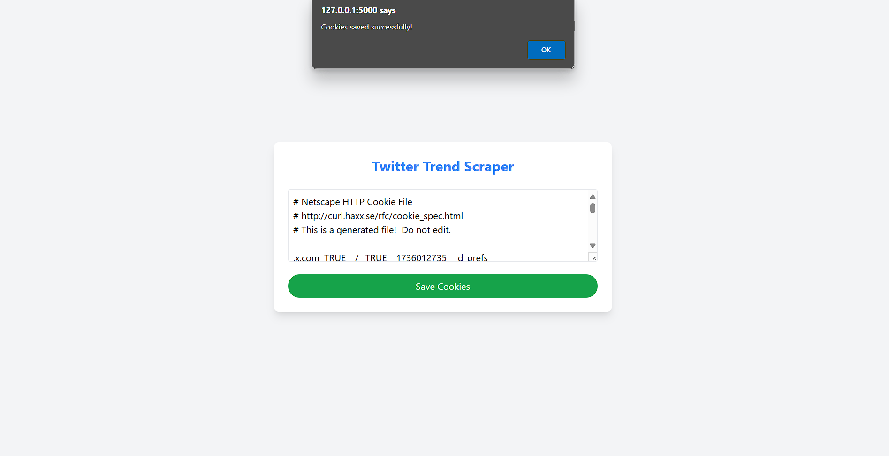

# X (Twitter) Trending Topics Scraper


A web application that scrapes trending topics from X's (formerly Twitter) "What's New" section, stores them in MongoDB, and maintains a local backup.

## Features

- Scrapes top 4 trending topics from X
- Stores trending data in MongoDB
- Creates local backup in `twitter_trends.txt`
- Web interface built with React + TypeScript + Vite

## Prerequisites

- Python 3.x
- Node.js and npm
- MongoDB instance
- Chrome browser
- "Get cookies.txt LOCALLY" browser extension

## Project Structure

```
|-- app.py                 # Main Flask application
|-- twitter_scrape.py      # Scraping logic
|-- twitter_trends.txt     # Local backup file
|-- requirements.txt       # Python dependencies
|-- .env                  # Environment variables
|-- drivers/              # Chrome driver directory
|-- cookies/              # Cookies storage
|-- frontend/             # React + TypeScript frontend
    |-- src/              # Source code
    |-- dist/             # Built files
    |-- public/           # Static assets
```

## Setup Instructions

### 1. Environment Setup

1. Clone the repository
2. Create a `.env` file based on `.env.example`
3. Add your MongoDB URI to the `.env` file:
   ```
   MONGODB_URI=your_mongodb_connection_string
   ```

### 2. Frontend Setup

```bash
# Navigate to frontend directory
cd frontend

# Install dependencies
npm install

# Build the frontend
npm run build
```

### 3. Cookie Authentication

1. Install the "Get cookies.txt LOCALLY" extension in your browser


2. Visit X (Twitter)


3. Use the extension to copy cookies


4. Paste the cookies when prompted by the application


> Note: Cookies are used only for authentication and are not stored permanently

### 4. Running the Application

```bash
# Return to root directory (if in frontend/)
cd ../

# Install Python dependencies
pip install -r requirements.txt

# Run the application
python app.py
```
## Scraped Data

## Scraped Data in MongoDB


## Important Notes

- The application requires valid X (Twitter) cookies for authentication
- Ensure Chrome browser and chromedriver versions match
- MongoDB connection must be established before running the application
- Frontend must be built before running the main application

## Tech Stack

- Backend: Python, Flask
- Frontend: React, TypeScript, Vite
- Database: MongoDB
- Styling: Tailwind CSS

## Contributing

Feel free to open issues and submit pull requests.

## License

[Add your chosen license here]